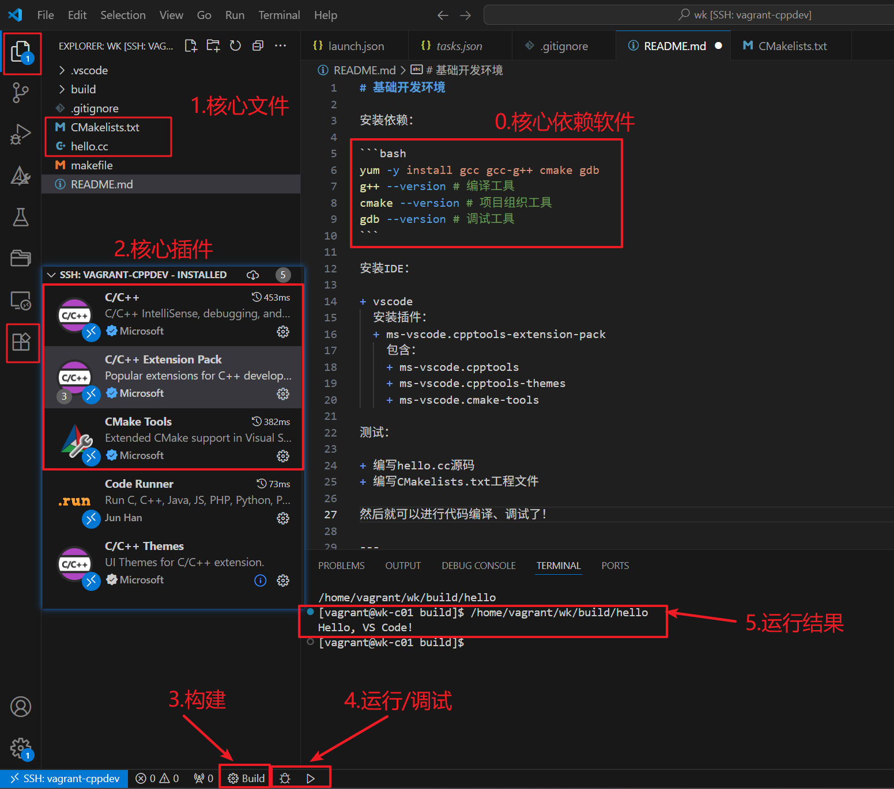

# C/C++基础开发环境

安装依赖：

```bash
g++ --version   # 编译工具
cmake --version # 项目组织工具
gdb --version   # 调试工具
vcpkg --version # 包管理工具
```

初始化：

1. `ctrl + shift + p`
cmake quick start

2. `vcpkg integrate install`
`vcpkg new --application`
`vcpkg add port zlib`
`vcpkg add port googletest`


