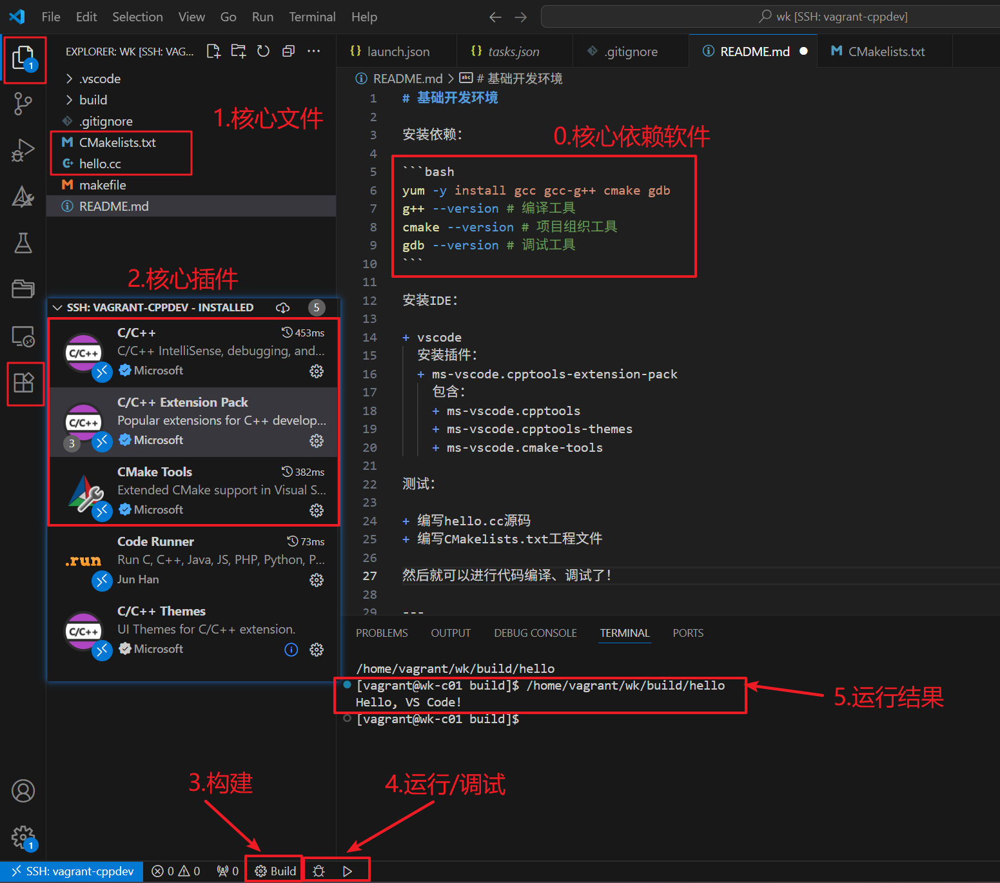

# C/C++基础开发环境

安装依赖：

```bash
yum -y install gcc gcc-g++ cmake gdb
g++ --version # 编译工具
cmake --version # 项目组织工具
gdb --version # 调试工具
```

安装IDE：

+ vscode
  安装插件：
  + ms-vscode.cpptools-extension-pack
    包含：
    + ms-vscode.cpptools
    + ms-vscode.cpptools-themes
    + ms-vscode.cmake-tools

测试：

+ 编写hello.cc源码
+ 编写CMakelists.txt工程文件

然后就可以进行代码编译、调试了！



---

参考：

+ ~~<https://www.cnblogs.com/lenmom/p/9193388.html>~~ —— 参考本README.md即可！
