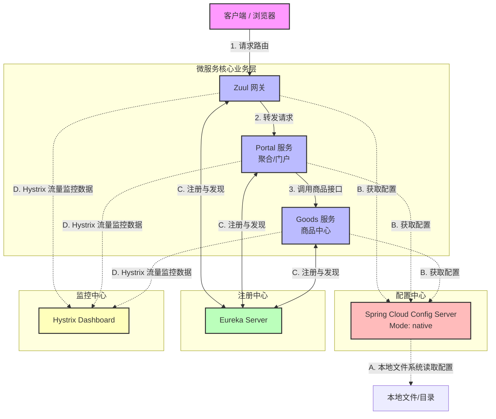

# 说明

```mermaid
graph TD
    %% 核心客户端入口
    Client[客户端 / 浏览器] -->|1. 请求路由| Zuul

    %% 核心网关与服务层
    subgraph Service_Mesh [微服务核心业务层]
        Zuul[Zuul 网关] -->|2. 转发请求| Portal[Portal 服务 <br/> 聚合/门户]
        Portal -->|3. 调用商品接口| Goods[Goods 服务 <br/> 商品中心]
    end

    %% 配置中心
    subgraph Config_Center [配置中心]
        Config[Spring Cloud Config Server <br/> Mode: native]
    end
    Config -.->|A. 本地文件系统读取配置| LocalF[本地文件/目录]
    Zuul -.->|B. 获取配置| Config
    Portal -.->|B. 获取配置| Config
    Goods -.->|B. 获取配置| Config

    %% 服务注册与发现
    subgraph Discovery_Center [注册中心]
        Eureka[Eureka Server]
    end
    Zuul <-->|C. 注册与发现| Eureka
    Portal <-->|C. 注册与发现| Eureka
    Goods <-->|C. 注册与发现| Eureka

    %% 熔断与监控
    subgraph Monitor_Center [监控中心]
        Hystrix[Hystrix Dashboard]
    end
    Zuul -.->|D. Hystrix 流量监控数据| Hystrix
    Portal -.->|D. Hystrix 流量监控数据| Hystrix
    Goods -.->|D. Hystrix 流量监控数据| Hystrix

    %% 样式调整
    style Client fill:#f9f,stroke:#333,stroke-width:2px
    style Zuul fill:#bbf,stroke:#333,stroke-width:2px
    style Portal fill:#bbf,stroke:#333,stroke-width:2px
    style Goods fill:#bbf,stroke:#333,stroke-width:2px
    style Eureka fill:#bfb,stroke:#333,stroke-width:2px
    style Config fill:#fbb,stroke:#333,stroke-width:2px
    style Hystrix fill:#ffb,stroke:#333,stroke-width:2px
```