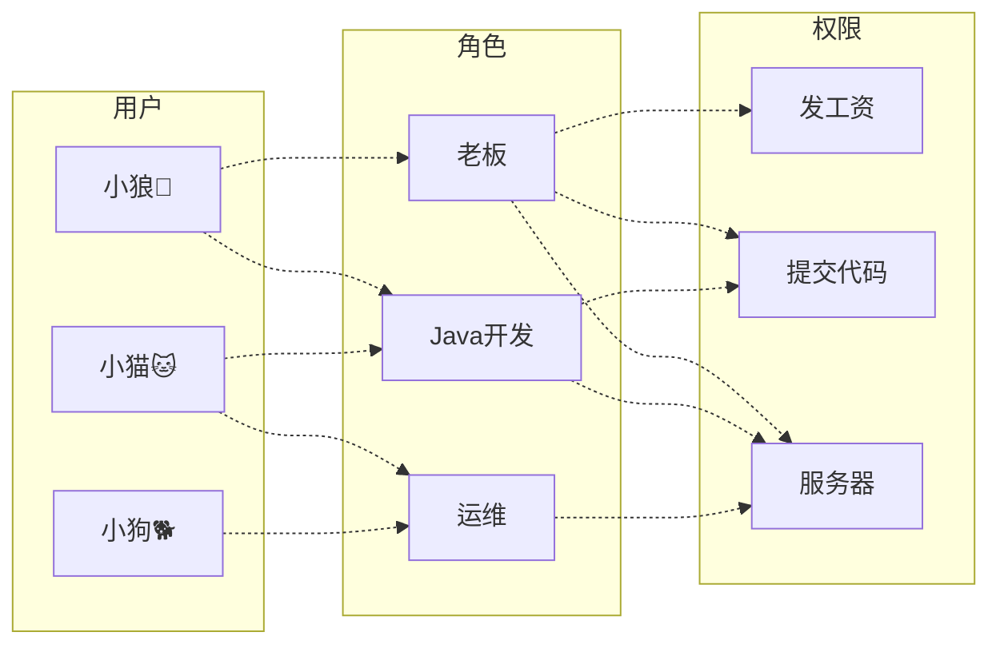
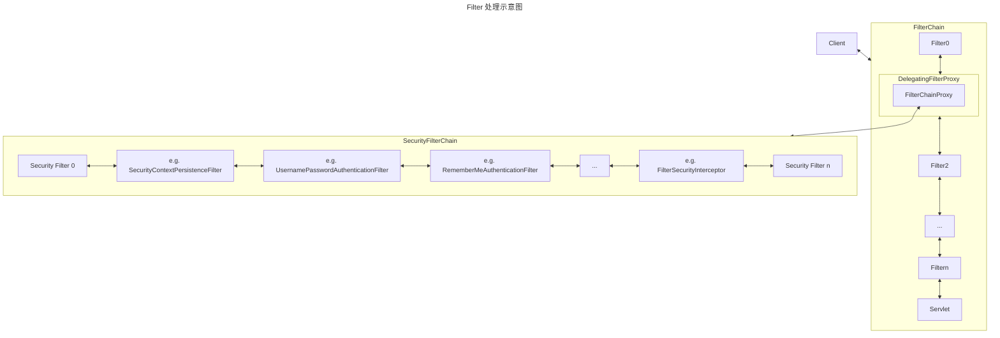
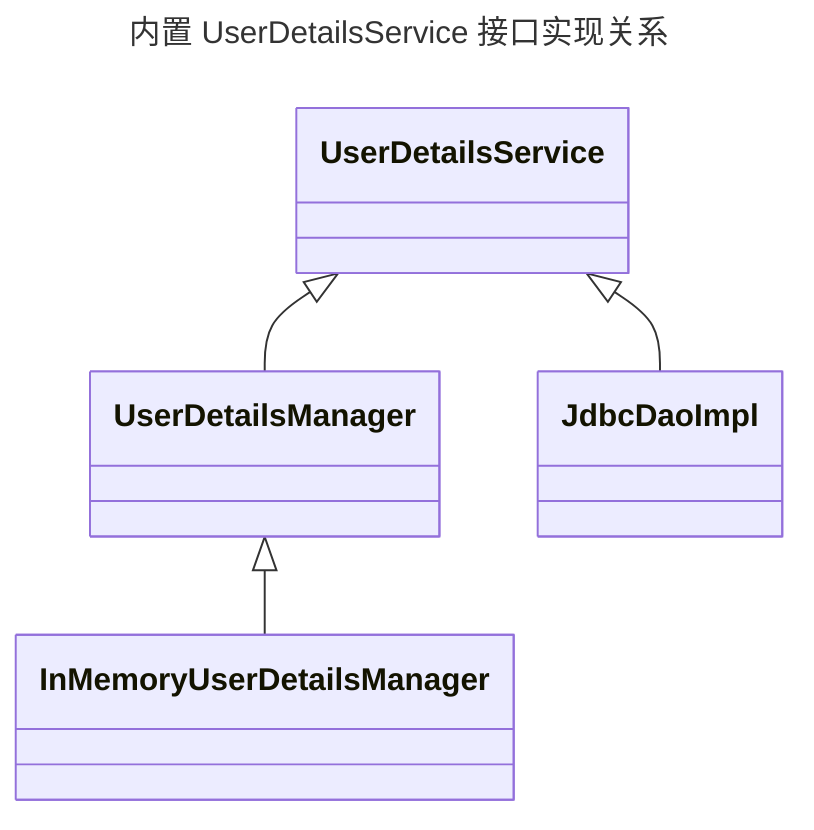

基于Spring web的Filter机制，为应用提供声明式安全访问控制功能。

特点

- 与 Spring Boot 集成简单
- 高度可定制化
- 支持CSRF（跨站请求伪造攻击）防护
- 提供 Spring Cloud 分布式组件

功能

- **认证（Authentication）**
  - 账号密码认证
  - LDAP
  - OAuth2.0
- **授权（Authorization）**

RBAC （Role Based Access Control） 访问控制 —— 基于角色的访问控制。通过 “用户、角色、权限” 三个概念，实现用户分配角色，角色分配权限的权限管理方式。


```mermaid
flowchart LR
subgraph 用户
  U1["小狼🐺"]
  U2["小猫🐱"]
  U3["小狗🐕"]
end
subgraph 角色
  R1["老板"]
  R2["Java开发"]
  R3["运维"]
end
subgraph 权限
  A1["发工资"]
  A2["提交代码"]
  A3["服务器"]
end
U1 -.-> R1
U1 -.-> R2
U2 -.-> R2
U2 -.-> R3
U3 -.-> R3
R1 -.-> A1
R1 -.-> A2
R1 -.-> A3
R2 -.-> A2
R2 -.-> A3
R3 -.-> A3
```

## Spring Security 介绍

利用 Spring IoC，DI（Inversion of Control，控制反转），DI（Dependency Injection，依赖注入）和 AOP（Aspect Oriented Programming，面向切面编程）功能，为应用提供声明式的安全访问控制功能。

特点

- 与 Spring Boot 集成简单
- 高度可定制化
- 支持 OAuth2.0
- 强大的加密 API
- 支持跨站请求伪造攻击（CSRF）防护
- 提供 Spring Cloud 分布式组件

```xml
<!-- Spring Boot 2.6.13 -->
<!-- Spring Security 5.6.8 -->
<dependencies>
  <dependency>
    <groupId>org.springframework.boot</groupId>
    <artifactId>spring-boot-starter-security</artifactId>
  </dependency>
</dependencies>
```

引入 `spring-boot-starter-security` 依赖即可实现 web 路径拦截：

1. 启动后，访问任何路径均会转跳到 `/login` 路径
2. 登录后（控制台有默认密码），才能访问目标页面

## Spring Security 工作原理

Spring Security 框架的核心是对应用进行认证和访问控制，希望在进入 `DispatcherServlet` 之前就对请求进行拦截分析处理，所以 Spring Security 的实现中用到了 Java Web 三大组件之一的 Filter 组件。

::: tip
过滤器（Filter）和拦截器（Interceptor）的区别：

1. 过滤器（Filter）由 Servlet 实现。
1. 拦截器（Interceptor）由 Spring MVC 实现，在进入 Servlet 后才被触发。

:::

### Filter 处理流程

::: tip

官方文档： <https://springdoc.cn/spring-security/servlet/architecture.html>

:::

下面演示了加入 Spring Security 后的 Filter 处理流程。


```mermaid
---
title: Filter 处理示意图
---
flowchart TD
  Client <--> FC0
  subgraph FC0["FilterChain"]
    Filter0
    subgraph Filter1["DelegatingFilterProxy"]
      FCP["FilterChainProxy"]
    end
    Filter2
    Filterp["..."]
    Filtern
    Servlet
    Filter0 <--> Filter1 <--> Filter2 <--> Filterp  <--> Filtern <--> Servlet
  end
  subgraph FC1["SecurityFilterChain"]
    SF0["Security Filter 0"]
    SF1["e.g. SecurityContextPersistenceFilter"]
    SF2["e.g. UsernamePasswordAuthenticationFilter"]
    SF3["e.g. RememberMeAuthenticationFilter"]
    SFp["..."]
    SFn1["e.g. FilterSecurityInterceptor"]
    SFn["Security Filter n"]
    SF0 <--> SF1 <--> SF2 <--> SF3 <--> SFp <--> SFn1 <--> SFn
  end
  FCP <--> FC1
```

说明：

- `FilterChain` —— Servlet 的过滤器链
  - **`DelegatingFilterProxy` —— Spring Web 提供的扩展机制，可以让其他组件往其注册过滤器完成代理功能**
    - `SecurityFilterChain` —— Spring Security 注入的过滤器链
      （调试该过滤器链，断点可以在 `org.springframework.security.web.FilterChainProxy.VirtualFilterChain#doFilter`）

Spring Security 引入的过滤器（按处理优先级排序）

- `DisableEncodeUrlFilter` —— 【可忽略】
- `WebAsyncManagerIntegrationFilter` —— 【可忽略】
- ~~`SecurityContextPersistenceFilter`~~（过时，换成 `SecurityContextHolderFilter`） —— 过滤链的入口和出口，负责将 SecurityContext 上下文对象关联到 SecurityContextHolder 对象。（在请求进来时，将上下文设置进 Holder 中；在请求结束后，将上下文从 Holder 中清除）
- `HeaderWriterFilter` —— 【可忽略】
- `CsrfFilter` —— 【可忽略】
- `LogoutFilter` —— 登出
- `UsernamePasswordAuthenticationFilter` —— 用来处理认证请求。在获得表单参数后会封装一个认证 token 对象，将其交由 AuthenticationManager 对象进行验证，验证完成后将结果交给 AuthenticationSuccessHandler 或者 AuthenticationFailHandler 处理器处理结果
- DefaultLoginPageGeneratingFilter —— 登录页面
- DefaultLogoutPageGeneratingFilter —— 登出页面
- BasicAuthenticationFilter
- RequestCacheAwareFilter
- SecurityContextHolderAwareRequestFilter —— ？？？
- `AnonymousAuthenticationFilter` —— 匿名访问
- SessionManagementFilter
- `ExceptionTranslationFilter` —— FilterChain 中任意过滤器抛出的异常都会被其捕获，但是只会处理 `AuthenticationException` 和 `AccessDeniedException` 异常，其他异常会继续往外抛出。
- `FilterSecurityInterceptor` —— 对于需要进行访问控制的 web 资源进行鉴权，最终交由 AccessDecisionManager 对象来进行权限决策，若通过则访问资源，否则拒绝访问并将请求交由 AccessDeniedHandler 来处理结果

::: note

上述标记 “【可忽略】” 的 Filter 主要起安全问题修复的作用，对理解 Spring Security 工作流程没有太大帮助，所以可以先忽略，后面涉及相关内容在看也来得及。

:::

### 认证/授权流程

我们一般不直接用 Spring Security 提供的默认认证/授权方式。
下面 Spring Security 的认证/授权怎么做的、需要什么，我们把相关内容重写就能完成认证/授权方式的扩展。

#### UserDetails

> `UserDetails = 认证/授权信息对象`

在 Spring Security 中，用户认证成功/失败后认证信息会被封装为 UserDetails 接口的实现类：

```java
public interface UserDetails extends Serializable {
  /**
   * 返回认证用户的所有权限
   */
  Collection<? extends GrantedAuthority> getAuthorities();
  /**
   * 返回认证用户的密码
   */
  String getPassword();
  /**
   * 返回认证用户的用户名
   */
  String getUsername();
  /**
   * 账户是否未过期
   */
  boolean isAccountNoExpired();
  /**
   * 账号是否为解锁状态
   */
  boolean isAccountNoLocked();
  /**
   * 账号的凭证是否未过期
   */
  boolean isCredentialsNonExpired();
  /**
   * 账号是否启用
   */
  boolean isEnabled();
}
```

#### UserDetailsService

> `UserDetailsService = 认证/授权信息查询接口`

Spring Security 提供 `UserDetailsService` 接口的 `loadUserByUsername` 方法专门用于基于用户名查询用户信息。


```mermaid
---
title: 内置 UserDetailsService 接口实现关系
---
classDiagram
  UserDetailsService <|-- UserDetailsManager
  UserDetailsService <|-- JdbcDaoImpl
  UserDetailsManager <|-- InMemoryUserDetailsManager
```

UserDetailsService 接口实现

- InMemoryUserDetailsManager —— 【默认】 在内存中管理用户信息，可以通过该类构建用户需要被认证的对象直接存入内存中
- JdbcDaoImpl —— 通过 jdbc 操作数据库中的用户与权限信息，相关数据表由 Spring Security 提供
- 自定义 UserDetailsService —— 如果想要自己实现从数据库获取用户的功能，可自行实现该 Service 的 loadUserByUsername 方法

::: tabs

@tab InMemoryUserDetailsManager

通过 createUser , manager 把用户配置的账号密码添加到 spring 的内存中。
InMemoryUserDetailsManager 类中有一个 loadUserByUsername 的方法通过账号（username）从内存中获取我们配置的账号密码，之后调用其他方法来判断前端用户输入的密码和内存中的密码是否匹配。

```java
@Bean
public UserDetailsService userDetailsService() {
	// 创建基于内存的用户信息管理器
  InMemoryUserDetailsManager manager = new InMemoryUserDetailsManager();
  manager.createUser(
    // 创建UserDetails对象，用于管理用户名、用户密码、用户角色、用户权限等内容
    User.withDefaultPasswordEncoder().username("user").password("user123").roles("USER").build()
  );
  // 如果自己配置的有账号密码, 那么上面讲的 user 和 随机字符串 的默认密码就不能用了
  return manager;
}
```

@tab JdbcDaoImpl

```java
@Service
public class UserDetailsServiceImpl implements UserDetailsService {
    @Autowired
    UserMapper userMapper;
    @Override
    public UserDetails loadUserByUsername(String username) throws UsernameNotFoundException {
        QueryWrapper<User> queryWrapper = new QueryWrapper<User>();
        queryWrapper.eq("username", username);	// 这里不止可以用username，你可以自定义，主要根据你自己写的查询逻辑
        User user = userMapper.selectOne(queryWrapper);
        if (user == null) {
            throw new UsernameNotFoundException(username);
        }
        return new UserDetailsImpl(user);	// UserDetailsImpl 是我们实现的类
    }
}
```

@tab 自定义 UserDetailsService

虽然，Spring Security 有提供默认的实现，但是这会限制我们的用户表结构，因此一般需要自己实现这个接口。

```java
@Service
public class UserServiceImpl implements UserDetailsService {
  private List<String> users = Arrays.asList("xiaoliu", "laoliu");
  private final static HashMap<String, String[]> AUTHORITIES = new HashMap<>();
  static {
    AUTHORITIES.put("xiaoliu", new String[] {"hr"});
    AUTHORITIES.put("laoliu", new String[] {"dev"});
  }
  @Override
  public UserDetails loadUserByUsername(String username) throws UsernameNotFoundException {
    if (!users.contains(username)) {
      throw new UsernameNotFoundException("用户名或用户密码错误！");
    }
    // Security 不推荐明文密码，使用明文密码需要在密码前加 "{noop}"
    String password = "{noop}1";
    // User 是 Security 提供的 UserDetails 的构建器
    return User.withUsername(username)
              .password(password)
              .authorities(AUTHORITIES.get(username))
              .build();
  }
}
```

:::

#### SecurityContextHolder 和 Authentication

像 Servlet 中有 ServletContext 存储上下文数据一样，Security 中也有一个 SecurityContext 存储认证的上下文数据，它就是 SecurityContextHolder。
另外，当一个用户认证通过后，认证信息会被封装为 Authentication 接口存入 SecurityContext 中，该认证信息包含用户认证后的所有信息。

> - `SecurityContextHolder = Security 应用的上下文数据`
> - `Authentication = 认证信息`

用户认证对象

```java
public interface Authentication extends Principal, Serializable {
  /**
   * 当前用户拥有的权限列表
   */
  Collection<? extends GrantedAuthority> getAuthorities();
  /**
   * 凭证信息
   * + 在用户密码认证的场景下，等同于用户密码，在用户认证成功后为了保障安全性，这个值会被清空
   */
  Object getCredentials();
  /**
   * 认证用户的详细信息，通常为 WebAuthenticationDetails 接口的实现类，保存了用户的 ip、sessionId 信息
   */
  Object getDetails();
  /**
   * 主体身份信息
   *
   * ❗注意：
   * 1. 认证成功前，该值一般为前端输入的 “用户名”
   * 2. 认证成功后，该值才会为 UserDetails
   */
  Object getPrincipal();
  /**
   * 是否已认证，只有返回 true 才表示用户已通过认证
   */
  boolean isAuthenticated();
  /**
   * 设置是否已认证属性
   */
  void setAuthenticated(boolean var1) throws IllegalArgumentException;
}
```

例子： 用户密码默认获取认证信息

```java
@Autowired
private AuthenticationManager authenticationManager;

UsernamePasswordAuthenticationToken authenticationToken = new UsernamePasswordAuthenticationToken(username, password);

// 从数据库中对比查找，如果找到了会返回一个带有认证的封装后的用户，否则会报错，自动处理。（这里我们假设我们配置的security是基于数据库查找的）
Authentication authenticate = authenticationManager.authenticate(authenticationToken);

// 获取认证后的用户
User user = (User) authenticate.getPrincipal();	// 如果强制类型转换报错的话，可以用我们实现的 `UserDetailsImpl` 类中的 getUser 方法了
```

::: tip

认证通过后，一般会把认证信息放入 SecurityContextHolder 中，方便业务代码取用。

SecurityContextHolder 的调用过程一般会封装为工具方法

```java
abstract public class SecurityUtils {
  /**
   * 获取上下文用户信息
   */
  public static UserDetails getLoginUser() {
    // todo principal instanceof UserDetails
    return (UserDetails) getAuthentication().getPrincipal();
  }
  /**
   * 获取上下文认证信息
   */
  public static Authentication getAuthentication() {
    return SecurityContextHolder.getContext().getAuthentication();
  }
  /**
   * 设置上下文认证信息
   */
  public static void setAuthentication(Authentication authentication) {
    SecurityContextHolder.getContext().setAuthentication(authentication);
  }
  /**
   * 清空上下文，for 登出
   */
  public static void clearContext() {
    SecurityContext context = SecurityContextHolder.createEmptyContext();
    SecurityContextHolder.setContext(context);
  }
  // public static String encryptPassword(String password) {
  //   return new BCryptPasswordEncoder().encode(password);
  // }
}
```

:::

## Spring Security 行为配置

创建一个配置类，继承 ~~WebSecurityConfigurerAdapter~~ 类。（已启用，新版用 `SecurityFilterChain`，参考 [link](https://spring.io/blog/2022/02/21/spring-security-without-the-websecurityconfigureradapter)）

::::: tabs

@tab 旧版写法

```java
@Configuration
public class WebSecurityConfig extends WebSecurityConfigurerAdapter {
  /**
   * 核心配置方法
   */
  @Override
  protected void configure(HttpSecurity http) throws Exception {
        /**
    * 基于内存的方式，创建两个用户admin/123456，user/123456
    * */
    // auth.inMemoryAuthentication()
    //         .withUser("admin")//用户名
    //         .password(passwordEncoder().encode("123456"))//密码
    //         .roles("ADMIN");//角色
    // auth.inMemoryAuthentication()
    //         .withUser("user")//用户名
    //         .password(passwordEncoder().encode("123456"))//密码
    //         .roles("USER");//角色
    // ...
    // e.g.
    http.authorizeRequests()
        // 登录页允许匿名访问
        .antMatchers("/login.jsp").anonymous();
        // 资源允许所有权限访问 <==> 不需要权限
        .antMatchers("/static/**").permitAll(); //配置静态文件不需要认证
        // 其他路径必须认证
        .antRequest().authenticated();
    http.formLogin()
        .loginPage("/login.jsp") // 登录页面
        .loginProcessingUrl("/login") // 处理登录的接口
        .usernameParameter("username")
        .passwordParameter("password")
        .defaultSuccessUrl("/");
    http
        // 使用默认的登陆登出页面进行授权登陆
        .formLogin(Customizer.withDefaults())
        // 启用“记住我”功能的。允许用户在关闭浏览器后，仍然保持登录状态，直到他们主动注销或超出设定的过期时间。
        .rememberMe(Customizer.withDefaults());
    // 关闭 csrf CSRF（跨站请求伪造）是一种网络攻击，攻击者通过欺骗已登录用户，诱使他们在不知情的情况下向受信任的网站发送请求。
    http.csrf(csrf -> csrf.disable());
  }
}
```

::: warning

关于上面放行路径写法的一些细节问题：

1. 如果在 application.properities 中配置的有 `server.servlet.context-path=/api` 前缀的话，在放行路径中不需要写 /api。
1. 如果 `@RequestMapping(value = "/test/")` 中写的是 `/test/`，那么放行路径必须也写成 `/test/`，否则 `/test` 是不行的，反之亦然。
1. 如果 `@RequestMapping(value = "/test")` 链接 `/test` 后面要加查询字符的话（e.g. `/test?type=0`），不要写成 `@RequestMapping(value = "/test/")`

:::

@tab 新版写法

```java
@Bean
public SecurityFilterChain filterChain(HttpSecurity http) throws Exception {
    http
            // 开启授权保护
            .authorizeHttpRequests(authorize -> authorize
                    // 不需要认证的地址有哪些
                    .requestMatchers("/blog/**", "/public/**", "/about").permitAll()	// ** 通配符
                    // 对所有请求开启授权保护
                    .anyRequest().
                    // 已认证的请求会被自动授权
                    authenticated()
            )
            // 使用默认的登陆登出页面进行授权登陆
            .formLogin(Customizer.withDefaults())
            // 启用“记住我”功能的。允许用户在关闭浏览器后，仍然保持登录状态，直到他们主动注销或超出设定的过期时间。
            .rememberMe(Customizer.withDefaults());
    // 关闭 csrf CSRF（跨站请求伪造）是一种网络攻击，攻击者通过欺骗已登录用户，诱使他们在不知情的情况下向受信任的网站发送请求。
    http.csrf(csrf -> csrf.disable());

    return http.build();
}
```

@tab 新版生产例子

一般完整的 SecurityConfig 如下：

```java
@Configuration
@EnableWebSecurity
public class SecurityConfig {

    @Autowired
    private JwtAuthenticationTokenFilter jwtAuthenticationTokenFilter;

    @Bean
    public PasswordEncoder passwordEncoder() {
        return new BCryptPasswordEncoder();
    }

    @Bean
    public AuthenticationManager authenticationManager(AuthenticationConfiguration authConfig) throws Exception {
        return authConfig.getAuthenticationManager();
    }

    @Bean
    public SecurityFilterChain filterChain(HttpSecurity http) throws Exception {
        http.csrf(CsrfConfigurer::disable) // 基于token，不需要csrf
                .sessionManagement((session) -> session.sessionCreationPolicy(SessionCreationPolicy.STATELESS)) // 基于token，不需要session
                .authorizeHttpRequests((authz) -> authz
                        .requestMatchers("/login/",  "/getPicCheckCode").permitAll() // 放行api
                        .requestMatchers(HttpMethod.OPTIONS).permitAll()
                        .anyRequest().authenticated()
                )
                .addFilterBefore(jwtAuthenticationTokenFilter, UsernamePasswordAuthenticationFilter.class);

        return http.build();
    }
}
```

:::::

::: info

HttpSecurity 的所有可配置项参考 <https://springdoc.cn/spring-security/servlet/configuration/java.html>

:::

### 配置首页

::: tabs

@tab 配置登录表单

```java title="WebSecurityConfig.java"
// (http as HttpSecurity).csrf().disable(); // 关闭 CSRF
(http as HttpSecurity).formLogin()
  .loginPage("/login.jsp")
  .loginProcessingUrl("/login") // 处理请求接口
  .usernameParameter("username")
  .passwordParameter("password")
  .defaultSuccessUrl("/");
```

@tab 引入 jsp 依赖

（如果前后端没有分离）

```xml title="pom.xml"
<dependency>
  <groupId>org.apache.tomcat.embed</groupId>
  <artifactId>tomcat-embed-jasper</artifactId>
</dependency>
<dependency>
  <groupId>javax.servlet</groupId>
  <artifactId>javax.servlet-api</artifactId>
</dependency>
<dependency>
  <groupId>javax.servlet</groupId>
  <artifactId>jstl</artifactId>
</dependency>
```

@tab 登录界面

```html title="src/main/webapp/login.jsp"
<%@ page contentType="text/html; charset=UTF-8" %>
<!DOCTYPE html>
<html lang="en">
  <head>
    <meta charset="UTF-8" />
    <title>登录页面</title>
  </head>
  <body>
    <h1>自定义登录页面</h1>
    <form action="/login" method="post">
      <span style="color: red;">${SPRING_SECURITY_LAST_EXCEPTION.message}</span>
      <br />
      用户名： <input type="text" name="username" /> <br />
      密码： <input type="password" name="password" /> <br />
      <button type="submit">登录</button>
    </form>
  </body>
</html>
```

:::

登录： `DefaultLoginPageGeneratingFilter` \
等出： `DefaultLogoutPageGeneratingFilter`

### 配置记住我功能

```java title="WebSecurityConfig.java"
@Autowired
private UserDetailsService userService;

(http as HttpSecurity).rememberMe()
  .rememberMeParameter("rememberMe") // cookie key!
  .tokenValiditySeconds(60 * 60 * 24)
  // 在用户第一次登录时，会调用该 service 的查询方法，获取用户对象，并进行编码存储到 cookie 中！
  .userDetailsService(userService);
```

### 配置 CSRF 防护

CSRF（Cross-site request forgery，跨站请求伪造）：攻击者在 A 网站中嵌入恶意代码，通过恶意代码利用 A 网站的 cookie 信息。

解决方案：

1. 只接收 POST 请求：由于 “同源策略” 的存在，极大的缓解了跨站请求攻击，但是依然能通过图片链接发送 GET 请求。相反，如果不接收 GET 请求（如改用 POST 请求）就能避免该问题。
1. ~~服务端利用 HTTP 协议请求头的 Referer 字段判断客户端是否合法~~ （依然容易被伪造）
1. 利用服务端生成的 token 验证：访问页面关键操作时，服务端响应一个 token 给客户端，客户端发起请求时携带该 token，服务端可以通过 token 判断客户端是否正确

::: tip
Spring Security 防止 CSRF 的思路不在判断请求类型，而是直接要求每个请求携带一个动态的 Token 字符串（方案三）。
Spring Security 利用 CsrfFilter 过滤器来返回和验证 token。只有在 token 有效时，才会进行后序处理，否则请求将会被直接拦截下来。
:::

::: tabs

@tab 开启 CSRF 防护

```java title="WebSecurityConfig.java"
// 注释这行代码，默认开启 CSRF 防护
// (http as HttpSecurity).csrf().disable(); // 关闭 CSRF
```

@tab 表单添加携带 csrf token 的隐藏值

```html{3}
<form action="/login" method="post">
  <span style="color: red;">${SPRING_SECURITY_LAST_EXCEPTION.message}</span> <br>
  <input type="hidden" name="${_csrf.parameterName}" value="${_csrf.token}">
  用户名： <input type="text" name="username"> <br>
  密码： <input type="password" name="password"> <br>
  <button type="submit">登录</button>
</form>
```

:::

### 配置加密算法

密码管理方面 Spring Security 提供了 PasswordEncoder 接口，用于定义密码的加密和验证方法。
主要有以下几种实现：

- BCryptPasswordEncoder：基于 BCrypt 算法，具有适应性和强大的加密强度。它可以根据需求自动调整加密的复杂性。
- NoOpPasswordEncoder：不执行加密，适用于开发和测试环境，不建议在生产环境中使用。
- Pbkdf2PasswordEncoder、Argon2PasswordEncoder 等：这些都是基于不同算法的实现，具有不同的安全特性。

::: tabs

@tab 配置 PasswordEncoder

```java
@Configuration
public class WebSecurigyConfig extends WebSecurityConfigurerAdapter {
  // 配置 Spring Security 默认的密码加密器
  @Bean
  public PasswordEncoder passwordEncoder() {
    // 也可用有参构造，取值范围是 4 到 31，默认值为 10。数值越大，加密计算越复杂
    return new BCryptPasswordEncoder(); // bcrypt 加密算法
  }
}
```

@tab 加密密码

```java
@Autowired
private PasswordEncoder passwordEncoder;

public void registerUser(String username, String rawPassword) {
    String encryptedPassword = passwordEncoder.encode(rawPassword);
    // 保存用户信息到数据库，包括加密后的密码
}
```

> 加密后，原明文密码一般要求从内存中擦除

@tab 解密密码

```java
public boolean login(String username, String rawPassword) {
    // 从数据库中获取用户信息，包括加密后的密码
    String storedEncryptedPassword = // 从数据库获取;
    return passwordEncoder.matches(rawPassword, storedEncryptedPassword);
}
```

:::

::: info

上面提到密码加密，Spring Security 提供如下加密算法：

| 加密算法 key | 加密类                                        | 特点                                                                   |
| ------------ | --------------------------------------------- | ---------------------------------------------------------------------- |
| bcrypt       | `new BCryptPasswordEncoder()`                 | 每次加密结果不同，但仍然能匹配明文是否一致。有助于防止明文被暴力破解。 |
| ldap         | `new LdapShaPasswordEncoder()`                |
| MD4          | `new Md4PasswordEncoder()`                    | （弃用）                                                               |
| MD5          | `new MessageDigestPasswordEncoder()`          | 信息摘要算法 （弃用：易被字典破解）                                    |
| noop         | `NoOpPasswordEncoder.getInstance()`           |
| pbkdf2       | `new Pbkdf2PasswordEncoder()`                 |
| scrypt       | `new SCryptPasswordEncoder()`                 |
| SHA-1        | `new MessageDigestPasswordEncoder("SHA-1")`   |
| SHA-256      | `new MessageDigestPasswordEncoder("SHA-256")` |
| sha256       | `new StandardPasswordEncoder()`               |
| argon2       | `new Argon2PasswordEncoder()`                 |

:::

::: info
Bcrypt 算法结构

```bash
$2a$10$BXXrB3MJcdfWr6kHM7o7AOVaGgw3duNuPMQqx1LUV4CoXxTHUJihO
$2a —— 第一部分： 是 hash 算法的唯一标识，理解为加密算法的版本
$10 —— 第二部分： 是 hash 的次数，表示为做 2 的 10 次方次 hash 运算
$BXXrB3MJcdfWr6kHM7o7AO —— 第三部分： 是 “盐 —— 每次使用的量都是不同的”，理解一个随机值，在每次加密是都不一样
VaGgw3duNuPMQqx1LUV4CoXxTHUJihO —— 第四部分： 是加密的运算结果，以 base64 编码形式表示
```

正是因为每次输入的 “盐” 不一样，所以每次运算结果不一样。所以有助于防止被字典破解。

:::

## Spring Security 前后端分离模式

Spring Security 默认的前后端交互模式是不分离的。改成前后端分离模式需要费点功夫。

前端：

1. 用户在登录界面输入用户名和密码。
1. 前端将这些凭证以 JSON 格式发送到后端的登录 API（例如 POST /api/login）。

后端：

1. Spring Security 接收请求，使用 AuthenticationManager 进行身份验证。
1. 如果认证成功，后端生成一个 JWT（JSON Web Token）或其他认证令牌，并将其返回给前端。

| 交互模式     | 示意图                                                                                                                                                                                                                                                                                       |
| ------------ | -------------------------------------------------------------------------------------------------------------------------------------------------------------------------------------------------------------------------------------------------------------------------------------------- |
| 非前后端分离 | <ul><li>返回页面形式，登录操作流程 <br> </li> <li> 返回页面形式，鉴权操作流程 <br>  </li></ul> |
| 前后端分离   |                                                                                                                                                                                                                              |

### 配置 Json 格式返回

:::::: tabs

@tab 开放 `/login` 接口权限

```java
(http as HttpSecurity).authorizeRequest()
  .antMatchers("/login.jsp", "/login").anonymous();
```

::: tip
需要在配置类中注册 `AuthenticationManager` 类：

```java
@Configuration
public class WebSecurityConfig extends WebSecurityConfigurerAdapter {
  @Bean
  protected AuthenticationManager authenticationManagerBean() throws Exception {
    return super.authenticationManagerBean();
  }
}
```

:::

@tab 完成登录接口

```java
@RestController
@RequestMapping("/login")
public class LoginController {
  @Autowired
  private AuthenticationManager authenticationManager;
  @Autowired
  private RedisTemplate<String, Object> redisTemplate;
  @PostMapping
  public R<Map<String, Object>> login(String username, String password, String rememberMe) {
    try {
      // 构建认证条件
      UsernamePasswordAuthenticationToken authenticationToken = new UsernamePasswordAuthenticationToken(username, password);
      // 认证
      Authentication authentication = authenticationManager.authenticate(authenticationToken);
      // 上下文存储认证结果
      SecurityContextHolder.getContext().setAuthentication(authentication);
      // 获取 EmployeeUserDetails 对象 （底层调用我们扩展的 UserServiceImpl 用户查询服务接口）
      EmployeeUserDetails principal = (EmployeeUserDetails) authentication.getPrincipal();
      // 生成 token
      String token = UUID.reandomUUID().toString().replaceAll("-", "");
      // 记录缓存
      redisTemplate.opsForValue().set(token, JsonUtils.toJson(principal.getEmployee()));
      // 返回
      HashMap<String, Object> map = new HashMap<>();
      map.put("token", token);
      map.put("user", principal.getEmployee());
      return R.ok(map);
    } catch (AuthenticationException e) {
      e.printStackTrace(); // todo
    }
    return R.err(401, "用户名或密码不正确！！！");
  }
}
```

::: tip

上面提到的 Redis 缓存可有可无。若使用则需要提前配置：

```xml
<dependency>
  <groupId>org.springframework.boot</groupId>
  <artifactId>spring-boot-starter-data-redis</artifactId>
</dependency>
```

```yml
# src/main/resources/application.yml
spring:
  redis:
    host: 127.0.0.1
    port: 6379
    password: admin
```

```java
@Configuration
public class RedisConfig {
  @Bean
  public RestTemplate<String, Object> restTemplate(RedisConnectionFactory factory) {
    RedisTemplate<String, Object> template = new RedisTemplate<>();
    template.setConnectionFactory(factory);
    // 设置 redis key 的序列化方式为字符串
    template.setKeySerializer(RedisSerializer.string());
    template.setHashKeySerializer(RedisSerializer.string());
    // 设置 redis value 的序列化方式为字符串
    template.setValueSerializer(RedisSerializer.json());
    template.setHashValueSerializer(RedisSerializer.json());
    return template;
  }
}
```

:::

@tab 用户查询服务接口

```java
@Service
public class UserServiceImpl implements UserDetailsService {
  private List<String> users = Arrays.asList("xiaoliu", "laoliu");
  private final static HashMap<String, String[]> AUTHORITIES = new HashMap<>();
  static {
    AUTHORITIES.put("xiaoliu", new String[] {"hr"});
    AUTHORITIES.put("laoliu", new String[] {"dev"});
  }
  @Override
  public UserDetails loadUserByUsername(String username) throws UsernameNotFoundException {
    if (!users.contains(username)) {
      throw new UsernameNotFoundException("用户名或用户密码错误！");
    }
    // Security 不推荐明文密码，使用明文密码需要在密码前加 "{noop}"
    String password = "{noop}1";
    // 【默认实现】
    // User 是 Security 提供的 UserDetails 的构建器
    // return User.withUsername(username)
    //           .password(password)
    //           .authorities(AUTHORITIES.get(username))
    //           .build();
    // 【根据现有数据库修改】
    Employee employee = new Employee(username, password);
    return new EmployeeUserDetails(employee, AUTHORITIES.get(username));
  }
}
```

@tab 用户对象封装

```java
public class EmployeeUserDetails implements UserDetails {
  private Employee employee; // 业务用户对象
  private List<GrantedAuthority> authorities;
  public EmployeeUserDetails(Employee employee, List<String> permissions) {
    this.employee = employee;
    if (permissions != null) {
      this.authorities = permissions.stream().map(GrantedAuthority::new).collect(Collectors.toList());
    }
  }
}
```

@tab 配置 token 校验拦截器

校验 token 的方式会不同：

- ~~csrf 校验 —— token 不存储信息，只做唯一标识。校验时只缓存中有或没有这 token 信息，有就放行~~ （缺点：1. 不加时间信息的话，容易被冒用 2. 没有权限管理）
- jwt 校验 —— 一种特殊结构的 token。可以在 token 中存储认证时间、过期时间、用户权限等信息，在外面再对这些信息做签名。校验时校验 token 有没有？有没有被篡改？内部的信息是否符合要求等...

这里先不展开，下面详细介绍

@tab 前端处理

1. 获取 JWT —— 前端发送 /login 接口请求，获取 JWT 信息
1. 存储 JWT —— 前端收到 JWT 后，可以将其存储在 localStorage 或 sessionStorage 中，以便后续请求使用。
1. 发送受保护请求 —— 在发送需要认证的请求时，前端将 JWT 添加到请求头中：

   ```js
   fetch("/api/protected-endpoint", {
     method: "GET",
     headers: {
       Authorization: `Bearer ${token}`,
     },
   });
   ```

::::::

### 配置 crfs token 校验 （不推荐）

不推荐的原因不是这种 crfs 模式安全有问题，而是通过 JWT 也能实现这效果，还附带其他有用的功能。
因此，建议直接用 JWT token 校验即可。

::: tabs

@tab 流程分析


@tab 拦截器

因为在 Spring Security 配置中放行了 `/login` 接口，所以要自行处理 crfs token 校验。

```java
@Component
public class VerifyTokenFilter extends HttpFilter {
  @Autowired
  private RedisTemplate<String, Object> redisTemplate;
  @Override
  protected void doFilter(HttpServletRequest request, HttpServletResponse response, FilterChain chain) throws IOException, ServletException {
    // 放行
    String uri = request.getRequestURI();
    if ("/login.jsp".equals(uri) || "/login".equals(uri)) {
      chain.doFilter(request, response);
      return;
    }
    // 获取请求 token
    String json = null;
    String token = request.getHeader("token");
    if(StringUtils.hasLength(token)) {
      json = (String) redisTemplate.opsForValue().get(token);
    }
    if (!StringUtils.hasLength(token) || !StringUtils.hasLength(json)) {
      R<Object> ret = R.err(401, "认证失败，请登录后再访问！");
      renderString(response, JsonUtils.toJson(ret));
      return;
    }
    // 将认证成功的对象保存到上下文中，避免因为用户禁用 cookie 导致登录失败
    Employee employee = JsonUtils.fromJSON(json, Employee.class); // 自行封装的反序列化方法
    String[] permissions = ; // 通过缓存获取权限 e.g. AUTHORITIES.get(employee.getUsername())
    EmployeeUserDetails employeeUserDetails = new EmployeeUserDetails(employee, AUTHORITIES.get(username))
    Authentication authentication = ; // 通过 employeeUserDetails 构建 Authentication
    SecurityContextHolder.getContext().setAuthentication(authentication);
    // 放行
    chain.doFilter(request, response);
  }
  private void renderString(HttpServletResponse response, String json) throws IOException {
    try {
      response.setStatus(200);
      response.setContentType("application/json");
      response.setCharacterEncoding("utf-8");
      response.getWriter().print(json);
    } catch (Exception e) {
      log.error("响应 json 数据失败！", e)
    }
  }
}
```

@tab

在配置类中注册，同时注销访问失败时的页面转跳配置

```java
@Configuration
public class WebSecurityConfig extends WebSecurityConfigurerAdapter {
  @Autowired
  private VerifyTokenFilter verifyTokenFilter;

  (http as HttpSecurity).addFilterBefore(verifyTokenFilter, UsernamePasswordAuthenticationFilter.class);
  // (http as HttpSecurity).formLogin()
  //       .loginPage("/login.jsp") // 登录页面
  //       .loginProcessingUrl("/login") // 处理登录的接口
  //       .usernameParameter("username")
  //       .passwordParameter("password")
  //       .defaultSuccessUrl("/");
}
```

:::

### 配置 JWT token 校验

::: tip
JWT 工具可以自己写，但推荐用 jjwt
:::

::::: tabs

@tab 编写 Filter

```java
import io.jsonwebtoken.Claims;
import org.jetbrains.annotations.NotNull;
import org.springframework.beans.factory.annotation.Autowired;
import org.springframework.security.authentication.UsernamePasswordAuthenticationToken;
import org.springframework.security.core.context.SecurityContextHolder;
import org.springframework.stereotype.Component;
import org.springframework.util.StringUtils;
import org.springframework.web.filter.OncePerRequestFilter;

import jakarta.servlet.FilterChain;
import jakarta.servlet.ServletException;
import jakarta.servlet.http.HttpServletRequest;
import jakarta.servlet.http.HttpServletResponse;
import java.io.IOException;

@Component
public class JwtAuthenticationTokenFilter extends OncePerRequestFilter {
    @Autowired
    private UserMapper userMapper;

    @Override
    protected void doFilterInternal(HttpServletRequest request, @NotNull HttpServletResponse response, @NotNull FilterChain filterChain) throws ServletException, IOException {
        String token = request.getHeader("Authorization");

        if (!StringUtils.hasText(token) || !token.startsWith("Bearer ")) {
            filterChain.doFilter(request, response);
            return;
        }

        token = token.substring(7);

        String userid;
        try {
            Claims claims = JwtUtil.parseJWT(token); // 💡JWT 工具可以自己写，但推荐用 jjwt
            userid = claims.getSubject();
        } catch (Exception e) {
            throw new RuntimeException(e);
        }

        User user = userMapper.selectById(Integer.parseInt(userid));

        if (user == null) {
            throw new RuntimeException("用户名未登录");
        }

        UserDetailsImpl loginUser = new UserDetailsImpl(user);
        UsernamePasswordAuthenticationToken authenticationToken =
                new UsernamePasswordAuthenticationToken(loginUser, null, null);

        // 如果是有效的jwt，那么设置该用户为认证后的用户
        SecurityContextHolder.getContext().setAuthentication(authenticationToken);

        filterChain.doFilter(request, response);
    }
}
```

@tab 注册 Filter

```java
http.addFilterBefore(jwtAuthenticationTokenFilter, UsernamePasswordAuthenticationFilter.class);
```

:::::

### 配置 Json 格式认证异常处理

看到 `ExceptionTranslationFilter.doFilter` 下的异常调用了 `handleSpringSecurityException` 方法，然后这个方法里面调用了 `AuthenticationEntryPoint` 接口的实现。

于是我们可以注入自定义 `AuthenticationEntryPoint` 接口的实现，来配置统一的异常处理。

```java
@Component
public class UnAuthEntryPointImpl implements AuthenticationEntryPoint {
  private static final Logger log = LoggerFactory.getLogger(UnAuthEntryPointImpl.class);
  @Override
  public void commence(HttpServletRequest request, HttpServletResponse response, AuthenticationException authException) throws IOException, ServletExcepton {
    log.warn("[认证异常处理] 用户未认证：", authException);
    R<Object> err = R.err(401, "用户未认证，请登录后再访问！");
    ServletUtils.renderString(response, err);
  }
}
```

::: tip
封装了 `ServletUtils` 工具类处理经常使用的响应处理。

```java
public static void renderString(HttpServletResponse response, String json) throws IOException {
  try {
    response.setStatus(200);
    response.setContentType("application/json");
    response.setCharacterEncoding("utf-8");
    response.getWriter().print(json);
  } catch (Exception e) {
    log.error("响应 json 数据失败！", e)
  }
}
```

:::

然后将上述的类注入到 Spring Security 配置中：

```java
@Autowired
private UnAuthEntryPointImpl unAuthEntryPoint;

(http as HttpSecurity).exceptionHandling()
  .authenticationEntryPoint(unAuthEntryPoint);
```

### 配置 Json 格式登出接口

看 `LoginFilter.doFilter` 方法调用了 `LogoutSuccessHandler` 接口。

```java
@Component
public class AuthLogoutSuccessHandler implements LogoutSuccessHandler {
  @Autowired
  private RedisTemplate<String, Object> redisTemplate;
  @Override
  public void onLogoutSuccess(HttpServletRequest request, HttpServletResponse response, Authentication authentication) throws IOException, ServletException {
    // 清空Redis信息
    String token = request.getHeader("token");
    // if (StringUtils.hasLength(token)) {
    //   redisTemplate.delete(token);
    // }
    if (!StringUtils.hasLength(token) || !StringUtils.hasLength(redisTemplate.opsForValue().get(token))) [
      throw new SessionAuthenticationException("用户未认证");
    ]
    // 清空上下文中的用户信息
    SecurityContext context = SecurityContextHolder.createEmptyContext();
    SecurityContextHolder.setContext(context);
    // 返回
    ServletUtils.renderString(response, R.ok());
  }
}
```

配置登出处理器

```java
@Autowired
private AuthLogoutSuccessHandler authLogoutSuccessHandler;

(http as HttpSecurity).logout()
  .logoutSuccessHandler(authLogoutSuccessHandler);
```

### 配置 Json 格式鉴权失败返回

::: tabs

@tab 配置鉴权逻辑

在原先的 `authorizeRequest` 方法后加上 `antMatchers` 指定路径和 `hasAnyAuthority` 指定需要的权限即可。

```java
(http as HttpSecurity).authorizeRequest()
  // ... 原先的配置
  .antMatchers("/employee/**").hasAnyRole("employee") // ROLE_employee
  .antMatchers("/employee/get").hasAnyAuthority("employee:list")
  // ...
  .anyRequest().authenticated();
```

> 在赋予权限/角色时，对于权限可以用 `employee:list` 的写法，但是对于角色需要用 `ROEL_employee` 的写法表示 `employee` 角色。

@tab 编写访问拒绝处理器

看到 `ExceptionTranslationFilter.doFilter` 下的异常调用了 `handleSpringSecurityException` 方法，然后这个方法里面调用了 `AccessDeniedHandler` 接口的实现。

```java
@Component
public class JsonAccessDeniedHandler implements AccessDeniedHandler {
  private static final Logger log = LoggerFactory.getLogger(JsonAccessDeniedHandler.class);
  @Override
  public void handle(HttpServletRequest request, HttpServletResponse response, AccessDeniedException accessDeniedException) throws IOException, ServletException {
    log.warn("[权限拒绝] 用户没有访问权限：", accessDeniedException)
    ServletUtils.renderString(response, R.err(403, "没有访问权限"))
  }
}
```

@tab 注册访问拒绝处理器配置

```java
@Autowired
private JsonAccessDeniedHandler jsonAccessDeniedHandler;

(http as HttpSecurity).exceptionHandling()
  // ...
  .accessDeniedHandler(jsonAccessDeniedHandler);
```

:::

## Spring Security 配置注解方式权限拦截

希望通过注解方式，在接口声明的地方注册访问行为，而不是将访问行为全部写在一个配置里面。

::: tip
意思就是干掉下面这种统一位置的配置

```java
(http as HttpSecurity).authorizeRequest()
  // ... 原先的配置
  .antMatchers("/employee/**").hasAnyRole("employee") // ROLE_employee
  .antMatchers("/employee/get").hasAnyAuthority("employee:list")
  // ...
  .anyRequest().authenticated();
```

改为在每个 Controller 上通过注解形式配置

```java
@RestController
@RequestMapping("/employees")
public class EmployeeController {
  @PreAuthorize("hasAuthority('employee:list') || hasRole('admin')")
  @GetMapping
  public String list() {
    return "<h1>员工管理列表</h1>";
  }
}
```

配置步骤如下：

::: tabs

@tab 开启注解

首先在配置类上使用开启注解 `@EnableGlobalMethodSecurity`

```java{1-10}
@EnableGlobalMethodSecurity(
  // 开启 @PreAuthorize、@PostAuthorize、@PreFilter、@PostFilter 注解支持
  // 支持 SpEL 表达式
  prePostEnabled = true,
  // 开启 @Secured 注解支持
  // ❗不支持 SpEL 表达式
  // ❗且只支持角色拦截，且角色需要加上 ROLE_ 前缀
  securedEnabled = true,
  // 开启 @RolesAllowed、@DenyAll、@PermitAll 注解
  jsr250Enabled = true
)
@Configuration
public class WebSecurityConfig extends WebSecurityConfigurerAdapter {
  // ...
}
```

@tab 配置访问权限

```java{4,9,14,19}
@RestController
@RequestMapping("/employees")
public class EmployeeController {
  @PreAuthorize("hasAuthority('employee:list') || hasRole('admin')")
  @GetMapping
  public String list() {
    return "<h1>员工管理列表</h1>";
  }
  @PreAuthorize("hasRole('boss')")
  @GetMapping("/save")
  public String save() {
    return "<h1>新增员工</h1>";
  }
  @Secured("ROLE_boss") // @Secured 注解中，角色需要加上 ROLE_ 前缀
  @GetMapping("/update")
  public String update() {
    return "<h1>更新员工</h1>";
  }
  @RolesAllowed({"admin", "hr"})
  @GetMapping("/delete")
  public String delete() {
    return "<h1>删除员工</h1>";
  }
}
```

:::

### 封装鉴权方法

封装鉴权方法，并且通过注解调用！

```java
@Service("ss")
public class PermissionServiceImpl implements PermissionService {
  @Override
  public boolean hasAuthority(String authority) {
    EnployeeUserDetails user = (EnployeeUserDetails) SecurityUtils.getLoginUser();
    Employee employee = user.getEmployee();
    // admin
    if (employee.isAdmin()) {
      return true;
    }
    // permission
    Collection<? extends GrantedAuthority> authorities = user.getAuthorities();
    for (GrantedAuthority grantedAuthority : authorities) {
      if (grantedAuthority.getAuhtority.equals(authority)) {
        return true;
      }
    }
    return false;
  }
}
```

```java
@RestController
@RequestMapping("/employees")
public class EmployeeController {
  @PreAuthorize("@ss.hasAuthority('employee:test')")
  @GetMapping
  public String list() {
    return "<h1>员工管理列表</h1>";
  }
}
```
