<!-- more -->


参考：

- https://www.bilibili.com/video/BV1jh411c7HV/

## 概念：权限体系设计

- **认证（Authentication）**
- **授权（Authorization）**

RBAC （Role Based Access Control） 访问控制 —— 基于角色的访问控制。通过 “用户、角色、权限” 三个概念，实现用户分配角色，角色分配权限的权限管理方式。

```mermaid
flowchart LR
subgraph 用户
  U1["小狼🐺"]
  U2["小猫🐱"]
  U3["小狗🐕"]
end
subgraph 角色
  R1["老板"]
  R2["Java开发"]
  R3["运维"]
end
subgraph 权限
  A1["发工资"]
  A2["提交代码"]
  A3["服务器"]
end
U1 -.-> R1
U1 -.-> R2
U2 -.-> R2
U2 -.-> R3
U3 -.-> R3
R1 -.-> A1
R1 -.-> A2
R1 -.-> A3
R2 -.-> A2
R2 -.-> A3
R3 -.-> A3
```

## Spring Security 介绍

利用 Spring IoC，DI（Inversion of Control，控制反转），DI（Dependency Injection，依赖注入）和 AOP（Aspect Oriented Programming，面向切面编程）功能，为应用提供声明式的安全访问控制功能。

特点

- 与 Spring Boot 集成简单
- 高度可定制化
- 支持 OAuth2.0
- 强大的加密 API
- 支持跨站请求伪造攻击（CSRF）防护
- 提供 Spring Cloud 分布式组件

```xml
<!-- Spring Boot 2.6.13 -->
<!-- Spring Security 5.6.8 -->
<dependencies>
  <dependency>
    <groupId>org.springframework.boot</groupId>
    <artifactId>spring-boot-starter-security</artifactId>
  </dependency>
  <!--
  <dependency>
    <groupId>org.springframework.boot</groupId>
    <artifactId>spring-boot-starter-web</artifactId>
  </dependency>
  <dependency>
    <groupId>org.springframework.boot</groupId>
    <artifactId>spring-boot-starter-test</artifactId>
  </dependency>
  <dependency>
    <groupId>org.springframework.boot</groupId>
    <artifactId>spring-security-test</artifactId>
  </dependency>
  -->
</dependencies>
```

引入 `spring-boot-starter-security` 依赖即可实现 web 路径拦截：

1. 启动后，访问任何路径均会转跳到 `/login` 路径
2. 登录后（控制台有默认密码），才能访问目标页面

## Spring Security 工作原理

Spring Security 框架的核心是对应用进行认证和访问控制，希望在进入 `DispatcherServlet` 之前就对请求进行拦截分析处理，所以 Spring Security 的实现中用到了 Java Web 三大组件之一的 Filter 组件。

::: tip
过滤器（Filter）和拦截器（Interceptor）的区别：

1. 过滤器（Filter）由 Servlet 实现。
1. 拦截器（Interceptor）由 Spring MVC 实现，在进入 Servlet 后才被触发。

:::

### Filter 处理流程

::: tip

官方文档： <https://springdoc.cn/spring-security/servlet/architecture.html>

:::

下面演示了加入 Spring Security 后的 Filter 处理流程。

```mermaid
---
title: Filter 处理示意图
---
flowchart TD
  Client <--> FC0
  subgraph FC0["FilterChain"]
    Filter0
    subgraph Filter1["DelegatingFilterProxy"]
      FCP["FilterChainProxy"]
    end
    Filter2
    Filterp["..."]
    Filtern
    Servlet
    Filter0 <--> Filter1 <--> Filter2 <--> Filterp  <--> Filtern <--> Servlet
  end
  subgraph FC1["SecurityFilterChain"]
    SF0["Security Filter 0"]
    SF1["e.g. SecurityContextPersistenceFilter"]
    SF2["e.g. UsernamePasswordAuthenticationFilter"]
    SF3["e.g. RememberMeAuthenticationFilter"]
    SFp["..."]
    SFn1["e.g. FilterSecurityInterceptor"]
    SFn["Security Filter n"]
    SF0 <--> SF1 <--> SF2 <--> SF3 <--> SFp <--> SFn1 <--> SFn
  end
  FCP <--> FC1
```



说明：

- `FilterChain` —— Servlet 的过滤器链
  - **`DelegatingFilterProxy` —— Spring Web 提供的扩展机制，可以让其他组件往其注册过滤器完成代理功能**
    - `SecurityFilterChain` —— Spring Security 注入的过滤器链
      （调试该过滤器链，断点可以在 `org.springframework.security.web.FilterChainProxy.VirtualFilterChain#doFilter`）

Spring Security 引入的过滤器（按处理优先级排序）

- `DisableEncodeUrlFilter` —— 【可忽略】
- `WebAsyncManagerIntegrationFilter` —— 【可忽略】
- ~~`SecurityContextPersistenceFilter`~~（过时，换成 `SecurityContextHolderFilter`） —— 过滤链的入口和出口，负责将 SecurityContext 上下文对象关联到 SecurityContextHolder 对象。（在请求进来时，将上下文设置进 Holder 中；在请求结束后，将上下文从 Holder 中清除）
- `HeaderWriterFilter` —— 【可忽略】
- `CsrfFilter` —— 【可忽略】
- `LogoutFilter` —— 登出
- `UsernamePasswordAuthenticationFilter` —— 用来处理认证请求。在获得表单参数后会封装一个认证 token 对象，将其交由 AuthenticationManager 对象进行验证，验证完成后将结果交给 AuthenticationSuccessHandler 或者 AuthenticationFailHandler 处理器处理结果
- DefaultLoginPageGeneratingFilter —— 登录页面
- DefaultLogoutPageGeneratingFilter —— 登出页面
- BasicAuthenticationFilter
- RequestCacheAwareFilter
- SecurityContextHolderAwareRequestFilter —— ？？？
- `AnonymousAuthenticationFilter` —— 匿名访问
- SessionManagementFilter
- `ExceptionTranslationFilter` —— FilterChain 中任意过滤器抛出的异常都会被其捕获，但是只会处理 `AuthenticationException` 和 `AccessDeniedException` 异常，其他异常会继续往外抛出。
- `FilterSecurityInterceptor` —— 对于需要进行访问控制的 web 资源进行鉴权，最终交由 AccessDecisionManager 对象来进行权限决策，若通过则访问资源，否则拒绝访问并将请求交由 AccessDeniedHandler 来处理结果

::: note

上述标记 “【可忽略】” 的 Filter 主要起安全问题修复的作用，对理解 Spring Security 工作流程没有太大帮助，所以可以先忽略，后面涉及相关内容在看也来得及。

:::

### 认证/授权流程

我们一般不直接用 Spring Security 提供的默认认证/授权方式。
下面 Spring Security 的认证/授权怎么做的、需要什么，我们把相关内容重写就能完成认证/授权方式的扩展。

#### UserDetails

> `UserDetails = 认证/授权信息对象`

在 Spring Security 中，用户认证成功/失败后认证信息会被封装为 UserDetails 接口的实现类：

```java
public interface UserDetails extends Serializable {
  /**
   * 返回认证用户的所有权限
   */
  Collection<? extends GrantedAuthority> getAuthorities();
  /**
   * 返回认证用户的密码
   */
  String getPassword();
  /**
   * 返回认证用户的用户名
   */
  String getUsername();
  /**
   * 账户是否未过期
   */
  boolean isAccountNoExpired();
  /**
   * 账号是否为解锁状态
   */
  boolean isAccountNoLocked();
  /**
   * 账号的凭证是否未过期
   */
  boolean isCredentialsNonExpired();
  /**
   * 账号是否启用
   */
  boolean isEnabled();
}
```

#### UserDetailsService

> `UserDetailsService = 认证/授权信息查询接口`

Spring Security 提供 `UserDetailsService` 接口的 `loadUserByUsername` 方法专门用于基于用户名查询用户信息。

```mermaid
---
title: 内置 UserDetailsService 接口实现关系
---
classDiagram
  UserDetailsService <|-- UserDetailsManager
  UserDetailsService <|-- JdbcDaoImpl
  UserDetailsManager <|-- InMemoryUserDetailsManager
```



UserDetailsService 接口实现

- InMemoryUserDetailsManager —— 【默认】 在内存中管理用户信息，可以通过该类构建用户需要被认证的对象直接存入内存中
- JdbcDaoImpl —— 通过 jdbc 操作数据库中的用户与权限信息，相关数据表由 Spring Security 提供
- 自定义 UserDetailsService —— 如果想要自己实现从数据库获取用户的功能，可自行实现该 Service 的 loadUserByUsername 方法

虽然，Spring Security 有提供默认的实现，但是这会限制我们的用户表结构，因此一般需要自己实现这个接口。

```java
@Service
public class UserServiceImpl implements UserDetailsService {
  private List<String> users = Arrays.asList("xiaoliu", "laoliu");
  private final static HashMap<String, String[]> AUTHORITIES = new HashMap<>();
  static {
    AUTHORITIES.put("xiaoliu", new String[] {"hr"});
    AUTHORITIES.put("laoliu", new String[] {"dev"});
  }
  @Override
  public UserDetails loadUserByUsername(String username) throws UsernameNotFoundException {
    if (!users.contains(username)) {
      throw new UsernameNotFoundException("用户名或用户密码错误！");
    }
    // Security 不推荐明文密码，使用明文密码需要在密码前加 "{noop}"
    String password = "{noop}1";
    // User 是 Security 提供的 UserDetails 的构建器
    return User.withUsername(username)
              .password(password)
              .authorities(AUTHORITIES.get(username))
              .build();
  }
}
```

#### SecurityContextHolder 和 Authentication

像 Servlet 中有 ServletContext 存储上下文数据一样，Security 中也有一个 SecurityContext 存储认证的上下文数据，它就是 SecurityContextHolder。
另外，当一个用户认证通过后，认证信息会被封装为 Authentication 接口存入 SecurityContext 中，该认证信息包含用户认证后的所有信息。

> - `SecurityContextHolder = Security 应用的上下文数据`
> - `Authentication = 认证信息`

用户认证对象

```java
public interface Authentication extends Principal, Serializable {
  /**
   * 当前用户拥有的权限列表
   */
  Collection<? extends GrantedAuthority> getAuthorities();
  /**
   * 凭证信息
   * + 在用户密码认证的场景下，等同于用户密码，在用户认证成功后为了保障安全性，这个值会被清空
   */
  Object getCredentials();
  /**
   * 认证用户的详细信息，通常为 WebAuthenticationDetails 接口的实现类，保存了用户的 ip、sessionId 信息
   */
  Object getDetails();
  /**
   * 主体身份信息
   *
   * ❗注意：
   * 1. 认证成功前，该值一般为前端输入的 “用户名”
   * 2. 认证成功后，该值才会为 UserDetails
   */
  Object getPrincipal();
  /**
   * 是否已认证，只有返回 true 才表示用户已通过认证
   */
  boolean isAuthenticated();
  /**
   * 设置是否已认证属性
   */
  void setAuthenticated(boolean var1) throws IllegalArgumentException;
}
```

::: tip

一般会把 SecurityContextHolder 的调用过程封装为工具方法

```java
abstract public class SecurityUtils {
  /**
   * 获取上下文用户信息
   */
  public static UserDetails getLoginUser() {
    // todo principal instanceof UserDetails
    return (UserDetails) getAuthentication().getPrincipal();
  }
  /**
   * 获取上下文认证信息
   */
  public static Authentication getAuthentication() {
    return SecurityContextHolder.getContext().getAuthentication();
  }
  /**
   * 设置上下文认证信息
   */
  public static void setAuthentication(Authentication authentication) {
    SecurityContextHolder.getContext().setAuthentication(authentication);
  }
  /**
   * 清空上下文，for 登出
   */
  public static void clearContext() {
    SecurityContext context = SecurityContextHolder.createEmptyContext();
    SecurityContextHolder.setContext(context);
  }
  // public static String encryptPassword(String password) {
  //   return new BCryptPasswordEncoder().encode(password);
  // }
}
```

:::

## Spring Security 行为配置

创建一个配置类，继承 ~~WebSecurityConfigurerAdapter~~ 类。（已启用，新版用 `SecurityFilterChain`，参考 [link](https://spring.io/blog/2022/02/21/spring-security-without-the-websecurityconfigureradapter)）

```java
@Configuration
public class WebSecurityConfig extends WebSecurityConfigurerAdapter {
  /**
   * 核心配置方法
   */
  @Override
  protected void configure(HttpSecurity http) throws Exception {
    // ...
    // e.g.
    http.authorizeRequests()
        // 登录页允许匿名访问
        .antMatchers("/login.jsp").anonymous();
        // 资源允许所有权限访问 <==> 不需要权限
        .antMatchers("/static/**").permitAll();
        // 其他路径必须认证
        .antRequest().authenticated();
    http.formLogin()
        .loginPage("/login.jsp") // 登录页面
        .loginProcessingUrl("/login") // 处理登录的接口
        .usernameParameter("username")
        .passwordParameter("password")
        .defaultSuccessUrl("/");
  }
}
```

::: info

HttpSecurity 的所有可配置项参考 <https://springdoc.cn/spring-security/servlet/configuration/java.html>

:::

### 配置首页

::: tabs

@tab 配置登录表单

```java title="WebSecurityConfig.java"
// (http as HttpSecurity).csrf().disable(); // 关闭 CSRF
(http as HttpSecurity).formLogin()
  .loginPage("/login.jsp")
  .loginProcessingUrl("/login") // 处理请求接口
  .usernameParameter("username")
  .passwordParameter("password")
  .defaultSuccessUrl("/");
```

@tab 引入 jsp 依赖

（如果前后端没有分离）

```xml title="pom.xml"
<dependency>
  <groupId>org.apache.tomcat.embed</groupId>
  <artifactId>tomcat-embed-jasper</artifactId>
</dependency>
<dependency>
  <groupId>javax.servlet</groupId>
  <artifactId>javax.servlet-api</artifactId>
</dependency>
<dependency>
  <groupId>javax.servlet</groupId>
  <artifactId>jstl</artifactId>
</dependency>
```

@tab 登录界面

```html title="src/main/webapp/login.jsp"
<%@ page contentType="text/html; charset=UTF-8" %>
<!DOCTYPE html>
<html lang="en">
  <head>
    <meta charset="UTF-8" />
    <title>登录页面</title>
  </head>
  <body>
    <h1>自定义登录页面</h1>
    <form action="/login" method="post">
      <span style="color: red;">${SPRING_SECURITY_LAST_EXCEPTION.message}</span>
      <br />
      用户名： <input type="text" name="username" /> <br />
      密码： <input type="password" name="password" /> <br />
      <button type="submit">登录</button>
    </form>
  </body>
</html>
```

:::

登录： `DefaultLoginPageGeneratingFilter` \
等出： `DefaultLogoutPageGeneratingFilter`

### 配置记住我功能

```java title="WebSecurityConfig.java"
@Autowired
private UserDetailsService userService;

(http as HttpSecurity).rememberMe()
  .rememberMeParameter("rememberMe") // cookie key!
  .tokenValiditySeconds(60 * 60 * 24)
  // 在用户第一次登录时，会调用该 service 的查询方法，获取用户对象，并进行编码存储到 cookie 中！
  .userDetailsService(userService);
```

### 配置 CSRF 防护

CSRF（Cross-site request forgery，跨站请求伪造）：攻击者在 A 网站中嵌入恶意代码，通过恶意代码利用 A 网站的 cookie 信息。

解决方案：

1. 只接收 POST 请求：由于 “同源策略” 的存在，极大的缓解了跨站请求攻击，但是依然能通过图片链接发送 GET 请求。相反，如果不接收 GET 请求（如改用 POST 请求）就能避免该问题。
1. ~~服务端利用 HTTP 协议请求头的 Referer 字段判断客户端是否合法~~ （依然容易被伪造）
1. 利用服务端生成的 token 验证：访问页面关键操作时，服务端响应一个 token 给客户端，客户端发起请求时携带该 token，服务端可以通过 token 判断客户端是否正确

::: tip
Spring Security 防止 CSRF 的思路不在判断请求类型，而是直接要求每个请求携带一个动态的 Token 字符串（方案三）。
Spring Security 利用 CsrfFilter 过滤器来返回和验证 token。只有在 token 有效时，才会进行后序处理，否则请求将会被直接拦截下来。
:::

::: tabs

@tab 开启 CSRF 防护

```java title="WebSecurityConfig.java"
// 注释这行代码，默认开启 CSRF 防护
// (http as HttpSecurity).csrf().disable(); // 关闭 CSRF
```

@tab 表单添加携带 csrf token 的隐藏值

```html{3}
<form action="/login" method="post">
  <span style="color: red;">${SPRING_SECURITY_LAST_EXCEPTION.message}</span> <br>
  <input type="hidden" name="${_csrf.parameterName}" value="${_csrf.token}">
  用户名： <input type="text" name="username"> <br>
  密码： <input type="password" name="password"> <br>
  <button type="submit">登录</button>
</form>
```

:::

### 配置加密算法

```java
@Configuration
public class WebSecurigyConfig extends WebSecurityConfigurerAdapter {
  // 配置 Spring Security 默认的密码加密器
  @Bean
  public PasswordEncoder passwordEncoder() {
    return new BCryptPasswordEncoder(); // bcrypt 加密算法
  }
}
```

::: info

上面提到密码加密，Spring Security 提供如下加密算法：

| 加密算法 key | 加密类                                        | 特点                                                                   |
| ------------ | --------------------------------------------- | ---------------------------------------------------------------------- |
| bcrypt       | `new BCryptPasswordEncoder()`                 | 每次加密结果不同，但仍然能匹配明文是否一致。有助于防止明文被暴力破解。 |
| ldap         | `new LdapShaPasswordEncoder()`                |
| MD4          | `new Md4PasswordEncoder()`                    | （弃用）                                                               |
| MD5          | `new MessageDigestPasswordEncoder()`          | 信息摘要算法 （弃用：易被字典破解）                                    |
| noop         | `NoOpPasswordEncoder.getInstance()`           |
| pbkdf2       | `new Pbkdf2PasswordEncoder()`                 |
| scrypt       | `new SCryptPasswordEncoder()`                 |
| SHA-1        | `new MessageDigestPasswordEncoder("SHA-1")`   |
| SHA-256      | `new MessageDigestPasswordEncoder("SHA-256")` |
| sha256       | `new StandardPasswordEncoder()`               |
| argon2       | `new Argon2PasswordEncoder()`                 |

:::

::: info
Bcrypt 算法结构

```bash
$2a$10$BXXrB3MJcdfWr6kHM7o7AOVaGgw3duNuPMQqx1LUV4CoXxTHUJihO
$2a —— 第一部分： 是 hash 算法的唯一标识，理解为加密算法的版本
$10 —— 第二部分： 是 hash 的次数，表示为做 2 的 10 次方次 hash 运算
$BXXrB3MJcdfWr6kHM7o7AO —— 第三部分： 是 “盐 —— 每次使用的量都是不同的”，理解一个随机值，在每次加密是都不一样
VaGgw3duNuPMQqx1LUV4CoXxTHUJihO —— 第四部分： 是加密的运算结果，以 base64 编码形式表示
```

正是因为每次输入的 “盐” 不一样，所以每次运算结果不一样。所以有助于防止被字典破解。

:::

## Spring Security 前后端分离模式

Spring Security 默认的前后端交互模式是不分离的。改成前后端分离模式需要费点功夫。

### 配置 Json 格式返回

:::::: tabs

@tab 流程分析

| 交互模式     | 示意图                                                                                                                                                                                                                                                                                       |
| ------------ | -------------------------------------------------------------------------------------------------------------------------------------------------------------------------------------------------------------------------------------------------------------------------------------------- |
| 非前后端分离 | <ul><li>返回页面形式，登录操作流程 <br> </li> <li> 返回页面形式，鉴权操作流程 <br>  </li></ul> |
| 前后端分离   |                                                                                                                                                                                                                              |

@tab 开放 `/login` 接口权限

```java
(http as HttpSecurity).authorizeRequest()
  .antMatchers("/login.jsp", "/login").anonymous();
```

@tab 前端接口

```java
@RestController
@RequestMapping("/login")
public class LoginController {
  @Autowired
  private AuthenticationManager authenticationManager;
  @Autowired
  private RedisTemplate<String, Object> redisTemplate;
  @PostMapping
  public R<Map<String, Object>> login(String username, String password, String rememberMe) {
    try {
      // 构建认证条件
      UsernamePasswordAuthenticationToken authenticationToken = new UsernamePasswordAuthenticationToken(username, password);
      // 认证
      Authentication authentication = authenticationManager.authenticate(authenticationToken);
      // 上下文存储认证结果
      SecurityContextHolder.getContext().setAuthentication(authentication);
      // 获取 EmployeeUserDetails 对象 （底层调用我们扩展的 UserServiceImpl 用户查询服务接口）
      EmployeeUserDetails principal = (EmployeeUserDetails) authentication.getPrincipal();
      // 生成 token
      String token = UUID.reandomUUID().toString().replaceAll("-", "");
      // 记录缓存
      redisTemplate.opsForValue().set(token, JsonUtils.toJson(principal.getEmployee()));
      // 返回
      HashMap<String, Object> map = new HashMap<>();
      map.put("token", token);
      map.put("user", principal.getEmployee());
      return R.ok(map);
    } catch (AuthenticationException e) {
      e.printStackTrace(); // todo
    }
    return R.err(401, "用户名或密码不正确！！！");
  }
}
```

::: tip
上面提到 `AuthenticationManager` 类需要在配置类中注册：

```java
@Configuration
public class WebSecurityConfig extends WebSecurityConfigurerAdapter {
  @Bean
  protected AuthenticationManager authenticationManagerBean() throws Exception {
    return super.authenticationManagerBean();
  }
}
```

:::

::: tip

上面提到的 Redis 缓存可有可无。若使用则需要提前配置：

```xml
<dependency>
  <groupId>org.springframework.boot</groupId>
  <artifactId>spring-boot-starter-data-redis</artifactId>
</dependency>
```

```yml
# src/main/resources/application.yml
spring:
  redis:
    host: 127.0.0.1
    port: 6379
    password: admin
```

```java
@Configuration
public class RedisConfig {
  @Bean
  public RestTemplate<String, Object> restTemplate(RedisConnectionFactory factory) {
    RedisTemplate<String, Object> template = new RedisTemplate<>();
    template.setConnectionFactory(factory);
    // 设置 redis key 的序列化方式为字符串
    template.setKeySerializer(RedisSerializer.string());
    template.setHashKeySerializer(RedisSerializer.string());
    // 设置 redis value 的序列化方式为字符串
    template.setValueSerializer(RedisSerializer.json());
    template.setHashValueSerializer(RedisSerializer.json());
    return template;
  }
}
```

:::

@tab 用户查询服务接口

```java
@Service
public class UserServiceImpl implements UserDetailsService {
  private List<String> users = Arrays.asList("xiaoliu", "laoliu");
  private final static HashMap<String, String[]> AUTHORITIES = new HashMap<>();
  static {
    AUTHORITIES.put("xiaoliu", new String[] {"hr"});
    AUTHORITIES.put("laoliu", new String[] {"dev"});
  }
  @Override
  public UserDetails loadUserByUsername(String username) throws UsernameNotFoundException {
    if (!users.contains(username)) {
      throw new UsernameNotFoundException("用户名或用户密码错误！");
    }
    // Security 不推荐明文密码，使用明文密码需要在密码前加 "{noop}"
    String password = "{noop}1";
    // 【默认实现】
    // User 是 Security 提供的 UserDetails 的构建器
    // return User.withUsername(username)
    //           .password(password)
    //           .authorities(AUTHORITIES.get(username))
    //           .build();
    // 【根据现有数据库修改】
    Employee employee = new Employee(username, password);
    return new EmployeeUserDetails(employee, AUTHORITIES.get(username));
  }
}
```

@tab 用户对象封装

```java
public class EmployeeUserDetails implements UserDetails {
  private Employee employee; // 业务用户对象
  private List<GrantedAuthority> authorities;
  public EmployeeUserDetails(Employee employee, List<String> permissions) {
    this.employee = employee;
    if (permissions != null) {
      this.authorities = permissions.stream().map(GrantedAuthority::new).collect(Collectors.toList());
    }
  }
}
```

::::::

### 配置 Json 格式 crfs token 校验

::: tabs

@tab 流程分析


@tab 拦截器

因为在 Spring Security 配置中放行了 `/login` 接口，所以要自行处理 crfs token 校验。

```java
@Component
public class VerifyTokenFilter extends HttpFilter {
  @Autowired
  private RedisTemplate<String, Object> redisTemplate;
  @Override
  protected void doFilter(HttpServletRequest request, HttpServletResponse response, FilterChain chain) throws IOException, ServletException {
    // 放行
    String uri = request.getRequestURI();
    if ("/login.jsp".equals(uri) || "/login".equals(uri)) {
      chain.doFilter(request, response);
      return;
    }
    // 获取请求 token
    String json = null;
    String token = request.getHeader("token");
    if(StringUtils.hasLength(token)) {
      json = (String) redisTemplate.opsForValue().get(token);
    }
    if (!StringUtils.hasLength(token) || !StringUtils.hasLength(json)) {
      R<Object> ret = R.err(401, "认证失败，请登录后再访问！");
      renderString(response, JsonUtils.toJson(ret));
      return;
    }
    // 将认证成功的对象保存到上下文中，避免因为用户禁用 cookie 导致登录失败
    Employee employee = JsonUtils.fromJSON(json, Employee.class); // 自行封装的反序列化方法
    String[] permissions = ; // 通过缓存获取权限 e.g. AUTHORITIES.get(employee.getUsername())
    EmployeeUserDetails employeeUserDetails = new EmployeeUserDetails(employee, AUTHORITIES.get(username))
    Authentication authentication = ; // 通过 employeeUserDetails 构建 Authentication
    SecurityContextHolder.getContext().setAuthentication(authentication);
    // 放行
    chain.doFilter(request, response);
  }
  private void renderString(HttpServletResponse response, String json) throws IOException {
    try {
      response.setStatus(200);
      response.setContentType("application/json");
      response.setCharacterEncoding("utf-8");
      response.getWriter().print(json);
    } catch (Exception e) {
      log.error("响应 json 数据失败！", e)
    }
  }
}
```

@tab

在配置类中注册，同时注销访问失败时的页面转跳配置

```java
@Configuration
public class WebSecurityConfig extends WebSecurityConfigurerAdapter {
  @Autowired
  private VerifyTokenFilter verifyTokenFilter;

  (http as HttpSecurity).addFilterBefore(verifyTokenFilter, UsernamePasswordAuthenticationFilter.class);
  // (http as HttpSecurity).formLogin()
  //       .loginPage("/login.jsp") // 登录页面
  //       .loginProcessingUrl("/login") // 处理登录的接口
  //       .usernameParameter("username")
  //       .passwordParameter("password")
  //       .defaultSuccessUrl("/");
}
```

:::

### 配置 Json 格式认证异常处理

看到 `ExceptionTranslationFilter.doFilter` 下的异常调用了 `handleSpringSecurityException` 方法，然后这个方法里面调用了 `AuthenticationEntryPoint` 接口的实现。

于是我们可以注入自定义 `AuthenticationEntryPoint` 接口的实现，来配置统一的异常处理。

```java
@Component
public class UnAuthEntryPointImpl implements AuthenticationEntryPoint {
  private static final Logger log = LoggerFactory.getLogger(UnAuthEntryPointImpl.class);
  @Override
  public void commence(HttpServletRequest request, HttpServletResponse response, AuthenticationException authException) throws IOException, ServletExcepton {
    log.warn("[认证异常处理] 用户未认证：", authException);
    R<Object> err = R.err(401, "用户未认证，请登录后再访问！");
    ServletUtils.renderString(response, err);
  }
}
```

::: tip
封装了 `ServletUtils` 工具类处理经常使用的响应处理。

```java
public static void renderString(HttpServletResponse response, String json) throws IOException {
  try {
    response.setStatus(200);
    response.setContentType("application/json");
    response.setCharacterEncoding("utf-8");
    response.getWriter().print(json);
  } catch (Exception e) {
    log.error("响应 json 数据失败！", e)
  }
}
```

:::

然后将上述的类注入到 Spring Security 配置中：

```java
@Autowired
private UnAuthEntryPointImpl unAuthEntryPoint;

(http as HttpSecurity).exceptionHandling()
  .authenticationEntryPoint(unAuthEntryPoint);
```

### 配置 Json 格式登出接口

看 `LoginFilter.doFilter` 方法调用了 `LogoutSuccessHandler` 接口。

```java
@Component
public class AuthLogoutSuccessHandler implements LogoutSuccessHandler {
  @Autowired
  private RedisTemplate<String, Object> redisTemplate;
  @Override
  public void onLogoutSuccess(HttpServletRequest request, HttpServletResponse response, Authentication authentication) throws IOException, ServletException {
    // 清空Redis信息
    String token = request.getHeader("token");
    // if (StringUtils.hasLength(token)) {
    //   redisTemplate.delete(token);
    // }
    if (!StringUtils.hasLength(token) || !StringUtils.hasLength(redisTemplate.opsForValue().get(token))) [
      throw new SessionAuthenticationException("用户未认证");
    ]
    // 清空上下文中的用户信息
    SecurityContext context = SecurityContextHolder.createEmptyContext();
    SecurityContextHolder.setContext(context);
    // 返回
    ServletUtils.renderString(response, R.ok());
  }
}
```

配置登出处理器

```java
@Autowired
private AuthLogoutSuccessHandler authLogoutSuccessHandler;

(http as HttpSecurity).logout()
  .logoutSuccessHandler(authLogoutSuccessHandler);
```

### 配置 Json 格式鉴权失败返回

::: tabs

@tab 配置鉴权逻辑

在原先的 `authorizeRequest` 方法后加上 `antMatchers` 指定路径和 `hasAnyAuthority` 指定需要的权限即可。

```java
(http as HttpSecurity).authorizeRequest()
  // ... 原先的配置
  .antMatchers("/employee/**").hasAnyRole("employee") // ROLE_employee
  .antMatchers("/employee/get").hasAnyAuthority("employee:list")
  // ...
  .anyRequest().authenticated();
```

> 在赋予权限/角色时，对于权限可以用 `employee:list` 的写法，但是对于角色需要用 `ROEL_employee` 的写法表示 `employee` 角色。

@tab 编写访问拒绝处理器

看到 `ExceptionTranslationFilter.doFilter` 下的异常调用了 `handleSpringSecurityException` 方法，然后这个方法里面调用了 `AccessDeniedHandler` 接口的实现。

```java
@Component
public class JsonAccessDeniedHandler implements AccessDeniedHandler {
  private static final Logger log = LoggerFactory.getLogger(JsonAccessDeniedHandler.class);
  @Override
  public void handle(HttpServletRequest request, HttpServletResponse response, AccessDeniedException accessDeniedException) throws IOException, ServletException {
    log.warn("[权限拒绝] 用户没有访问权限：", accessDeniedException)
    ServletUtils.renderString(response, R.err(403, "没有访问权限"))
  }
}
```

@tab 注册访问拒绝处理器配置

```java
@Autowired
private JsonAccessDeniedHandler jsonAccessDeniedHandler;

(http as HttpSecurity).exceptionHandling()
  // ...
  .accessDeniedHandler(jsonAccessDeniedHandler);
```

:::

## Spring Security 配置注解方式权限拦截

希望通过注解方式，在接口声明的地方注册访问行为，而不是将访问行为全部写在一个配置里面。

::: tip
意思就是干掉下面这种统一位置的配置

```java
(http as HttpSecurity).authorizeRequest()
  // ... 原先的配置
  .antMatchers("/employee/**").hasAnyRole("employee") // ROLE_employee
  .antMatchers("/employee/get").hasAnyAuthority("employee:list")
  // ...
  .anyRequest().authenticated();
```

改为在每个 Controller 上通过注解形式配置

```java
@RestController
@RequestMapping("/employees")
public class EmployeeController {
  @PreAuthorize("hasAuthority('employee:list') || hasRole('admin')")
  @GetMapping
  public String list() {
    return "<h1>员工管理列表</h1>";
  }
}
```

配置步骤如下：

::: tabs

@tab 开启注解

首先在配置类上使用开启注解 `@EnableGlobalMethodSecurity`

```java{1-10}
@EnableGlobalMethodSecurity(
  // 开启 @PreAuthorize、@PostAuthorize、@PreFilter、@PostFilter 注解支持
  // 支持 SpEL 表达式
  prePostEnabled = true,
  // 开启 @Secured 注解支持
  // ❗不支持 SpEL 表达式
  // ❗且只支持角色拦截，且角色需要加上 ROLE_ 前缀
  securedEnabled = true,
  // 开启 @RolesAllowed、@DenyAll、@PermitAll 注解
  jsr250Enabled = true
)
@Configuration
public class WebSecurityConfig extends WebSecurityConfigurerAdapter {
  // ...
}
```

@tab 配置访问权限

```java{4,9,14,19}
@RestController
@RequestMapping("/employees")
public class EmployeeController {
  @PreAuthorize("hasAuthority('employee:list') || hasRole('admin')")
  @GetMapping
  public String list() {
    return "<h1>员工管理列表</h1>";
  }
  @PreAuthorize("hasRole('boss')")
  @GetMapping("/save")
  public String save() {
    return "<h1>新增员工</h1>";
  }
  @Secured("ROLE_boss") // @Secured 注解中，角色需要加上 ROLE_ 前缀
  @GetMapping("/update")
  public String update() {
    return "<h1>更新员工</h1>";
  }
  @RolesAllowed({"admin", "hr"})
  @GetMapping("/delete")
  public String delete() {
    return "<h1>删除员工</h1>";
  }
}
```

:::

### 封装鉴权方法

封装鉴权方法，并且通过注解调用！

```java
@Service("ss")
public class PermissionServiceImpl implements PermissionService {
  @Override
  public boolean hasAuthority(String authority) {
    EnployeeUserDetails user = (EnployeeUserDetails) SecurityUtils.getLoginUser();
    Employee employee = user.getEmployee();
    // admin
    if (employee.isAdmin()) {
      return true;
    }
    // permission
    Collection<? extends GrantedAuthority> authorities = user.getAuthorities();
    for (GrantedAuthority grantedAuthority : authorities) {
      if (grantedAuthority.getAuhtority.equals(authority)) {
        return true;
      }
    }
    return false;
  }
}
```

```java
@RestController
@RequestMapping("/employees")
public class EmployeeController {
  @PreAuthorize("@ss.hasAuthority('employee:test')")
  @GetMapping
  public String list() {
    return "<h1>员工管理列表</h1>";
  }
}
```
