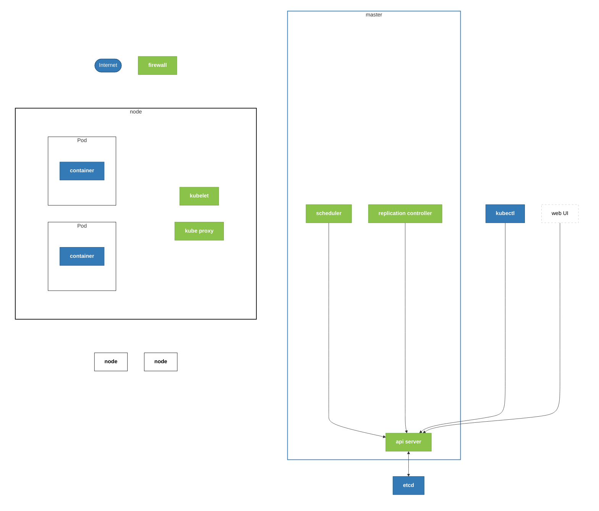

介绍 Kubernetes 的[生态](https://www.cncf.io)、基本功能、架构、组件。

<!-- more -->

> 文档：
>
> - 官方文档 —— <https://kubernetes.io/zh-cn/docs/home/>

## 介绍

作用：
k8s 处理“自动化部署、弹性伸缩和全面管理容器化应用”问题。

其他类似产品的问题：

- Mesos —— 并非专为容器设计，需配合 Marathon 使用，架构与配置极其复杂，且目前社区活跃度低、基本退出容器编排主流市场。
- Docker Swarm —— 功能过于单一，缺乏复杂的调度策略、高级自动补救（Self-healing）和大规模集群管理能力，生态与社区活跃度已边缘化。

## 集群 （宏观架构）

Master 节点 —— 管理端，负责维护整个集群正常运行

- 数量： 3 / 5 / 7 / 9 —— 由于etcd的raft选举算法，要求集群节点个数为奇数个

Node 节点 —— 负责提供业务处理的算力资源

- 数量： 基于业务需求决定

## 架构 （微观架构）

相关组件

- internet
- firewall

- kubectl （命令行工具） —— 用户发送管理指令给 api server 的官方客户端入口。一般在 master 节点中存在这个工具。
- Web UI （可选） —— 可视化 kubectl 操作

- master 集群
  - api server （通信枢纽） —— 负责接收 kubectl 命令和集群间通信
  - scheduler （资源调度器） —— 决定 Pod 部署哪个 node 节点上。
  - replication controller （副本控制器） —— 确保 Pod 副本数量符合预期。
- etcd （键值数据库） —— 负责存储集群所有配置与状态数据，仅允许 api server 直接读写的数据库。

- node 集群
  - kubelet （通信枢纽） —— 接收 master 集群 api server 的命令
  - kube proxy （流量调度器） —— 负责维护节点的网络规则，确保流量被正确路由
  - pod / [container](./container/README.md) （计算最小单元） —— 负责运行计算任务

## 环境搭建

运维同学至少手工搭建一次“[二进制安装](#id-laboratory-binary)”，开发同学只想知道怎么使用可以使用下面快速搭建工具。

K8S官方有推荐几种快速搭建实验环境的工具： <https://kubernetes.io/docs/tasks/tools/>

- [kubeadm](#id-laboratory-kubeadm)
- [minikube](#id-laboratory-minikube)
- [kind](#id-laboratory-kind)
- [k3d](#id-laboratory-k3d)
- k3s

### 二进制安装 {id=id-laboratory-binary}

todo

### kubeadm {id=id-laboratory-kubeadm}

todo

### minikube {id=id-laboratory-minikube}

[link_minikube](./minikube.md)

安装步骤：
<https://minikube.sigs.k8s.io/docs/start/?arch=%2Fwindows%2Fx86-64%2Fstable%2F.exe+download>

### Kind {id=id-laboratory-kind}

https://www.lixueduan.com/posts/kubernetes/15-kind-kubernetes-in-docker/

### k3d {id=id-laboratory-k3d}

https://coding.gs/2024/04/03/k3d/getting-started-with-k3d/

## 工具

### Helm

helm是kubernetes的包管理工具，可以将应用程序打包成一个可复用的单元，方便在集群中部署和管理。
helm的核心是chart，chart是应用程序的打包文件，包含应用程序的配置、部署文件和依赖关系。

[link_helm](./helm.md)

## 认证

CKA
todo https://www.bilibili.com/video/BV1hYcgzeEjG
